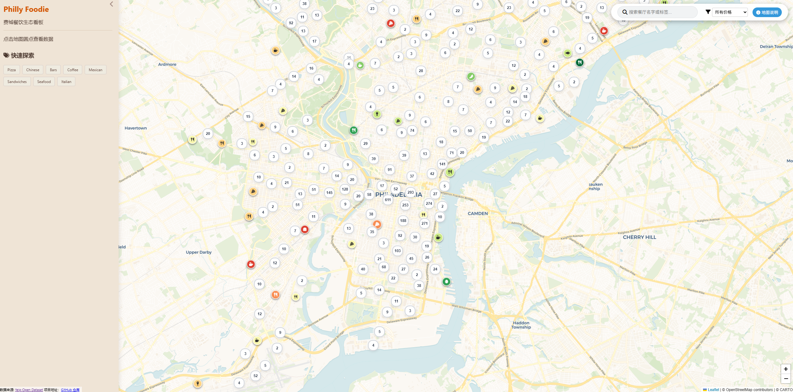
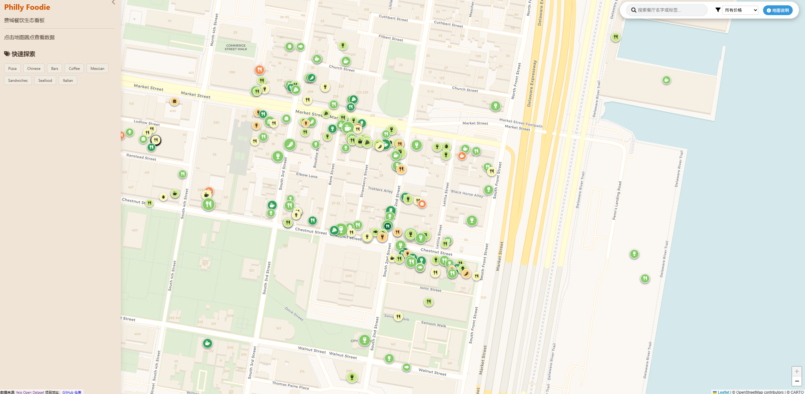
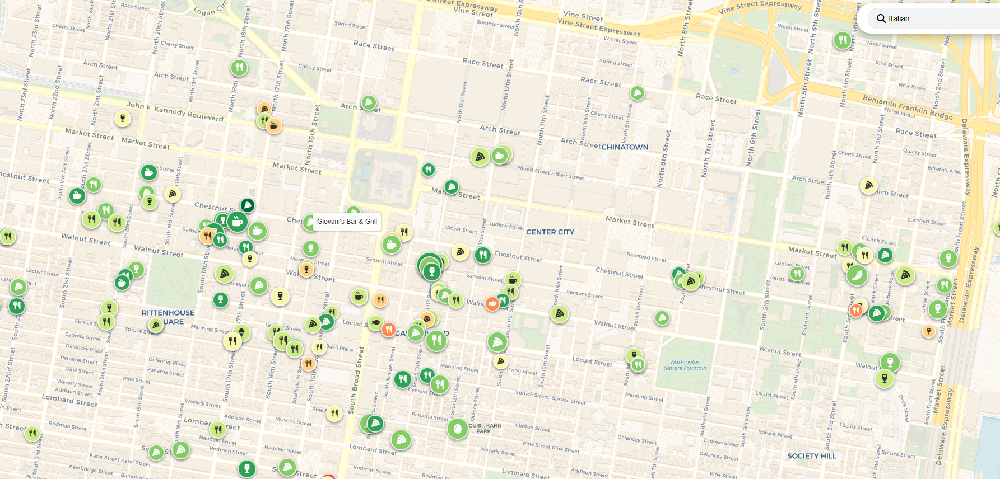
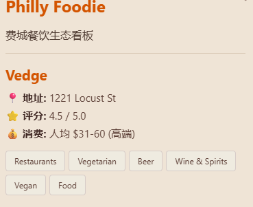
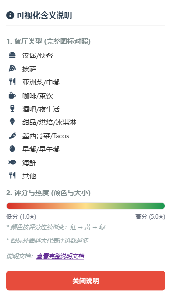

# 说明文档
---

# 费城美食交互地图 (Philly Foodie)

## 1. 旨在解答什么问题？
**对于在费城的人来说，今天吃什么？哪吃的多？吃的好？吃的便宜？**
本项目旨在通过交互式空间可视化，直观地呈现Philadelphia的餐饮商业生态，方便游客/居民。
**灵感来源于zipecode，希望从地图上直接映射一些有用的餐厅信息**

## 2. 设计决策的依据
### 2.1 可视化编码选择
为了在单张地图上承载多维度的信息且不显杂乱，项目在真实地图上将餐厅作为独立的圆圈来显示，具体有以下指标：
* **位置 (Position)**：将餐厅位置利用经纬度映射至 2D Web 地图，最直观地反映真实地理空间
* **颜色 (Color)**：编码**商户评分 (Stars)**:绿色代表高分 (≥4星)，黄色代表中等 (3-3.5星)，红色代表低分 (<3星)
* **面积 (Size)**：编码**商户热度 (Review Count)**:圆圈半径设定为评论数平方根的函数（`Math.sqrt(review_count)`），因为视觉面积与半径平方成正比，这样能真实且线性地反映热度差距，避免过大节点遮挡屏幕。
* **图标 (Shape/Icon)**：编码**餐饮分类 (Categories)**。通过提取餐厅相应标签，将餐厅分类映射为特定的 FontAwesome 矢量图标（如汉堡、咖啡杯、酒杯等），能够更直观观察类别分布。

### 2.2 交互技术 (Interaction Techniques)
* **按需查看细节**：点击地图图标，左侧边栏（可拉伸/折叠）会动态加载该餐厅的详细信息与标签。
* **多维过滤**：顶部导航栏提供文本搜索（匹配店名或标签）和价格区间下拉框，实现数据的实时筛选与重绘。
* **探索式联动**：侧边栏的分类标签（Tag Cloud）支持点击联动，点击标签即可自动填充搜索框并触发地图过滤。

### 2.3 替代方案与最终选择
* **替代方案1：热力图**。最初考虑用热力图展示繁华程度。**放弃原因**：热力图会抹杀个体商户的特征（如评分、品类、具体位置），不适合“找店”这一核心需求。
* **替代方案2：3D柱状图**。考虑用 3D 柱体高度代表评论数。**放弃原因**：在 Web 2D 地图上强行引入 3D 会导致严重的遮挡问题，且对浏览器性能要求过高。
* **最终选择**：采用 **“分类图标 + 点聚合”**。在宏观缩放时，通过聚合簇展示密度；在微观街区级别，通过颜色、大小、图标展示多维细节。

## 3. 外部资源引用
* **数据来源**：
  * **[Yelp Open Dataset](https://business.yelp.com/data/resources/open-dataset/)**：提取并清洗了其中的 `business.json` 和 `checkin.json` 数据集，过滤出费城区域的餐饮商户。
* **开源库与框架**：
  * **Leaflet.js**：核心地图渲染引擎。
  * **Leaflet.markercluster**：用于处理海量地图打点的性能优化插件。
  * **D3.js (v7)**：用于高效异步读取和解析 CSV 数据文件。
  * **FontAwesome**：提供地图上的商户分类矢量图标。
* **地图底图 (Base Map)**：
  * 使用了 **CartoDB Positron / OpenStreetMap** 提供的轻量化彩色地图切片，并搭配了自定义的CSS 样式。

## 4. 项目概览与使用说明
本项目是一个完全基于前端运行的交互式 Web 应用程序。
网站入口：https://anontoky.github.io/Philly-Foodie/
* **操作指南**：
  1. **浏览**：使用鼠标滚轮或者右下角的+-号缩放地图，地图上的数字圆圈会自动散开为具体的餐厅图标，这样可以方便**直接观察哪里餐厅密集，并具体查看**。
  
  
  2. **筛选**：在页面上方搜索框输入你想吃的菜系（如 "Pizza", "Chinese"）或店名，或者点击右侧边栏的快速检索中的标签，也可结合右侧的“价格”下拉框进行交叉筛选，**可观察特定品类、价格层次餐厅的聚集情况**。
  
  3. **查看**：点击地图上感兴趣的商户图标，页面左侧会滑出详情面板，展示地址、精确评分、消费水平等信息。
  
  4. **图例**：点击右上角“地图说明”按钮可随时查看视觉编码的具体含义。
  

## 5. 开发流程概述
* **总耗时**：约 **12小时**。
* **具体开发环节耗时**：
  * **环节一：数据清洗与预处理（约 1 小时）**。处理 Yelp 原始的 8.65GB JSON 文件。使用 Python (Pandas) 分块读取，提取了坐标、属性并扁平化，最终生成了轻量级的 `csv` 文件供前端调用。
  * **环节二：基础架构（约 3 小时）**。搭建 HTML/CSS 布局，利用 D3 加载数据，并将数据字段成功映射到 Leaflet 的自定义 DivIcon 上（颜色、大小、形状的逻辑计算）。
  * **环节三：交互逻辑（约 3 小时）**。编写 JS 实现搜索框、价格下拉菜单、侧边栏拉伸以及标签过滤等。
  * **环节四：优化性能（约 4 小时）【耗时最多】**。在初次渲染数千个 DOM 图标时遭遇了严重的浏览器卡顿。通过查阅文档和询问ai，引入并配置了 `MarkerCluster` 插件，重构了图层添加逻辑，最终实现了丝滑的缩放体验。
  * **环节五：文档撰写和其他工作（约 1 小时）**。调整配色方案为浅色系，优化了弹窗样式，并撰写本说明文档。